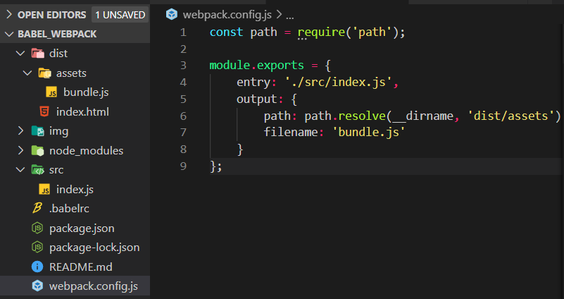

# Babel & Webpack

## How to install babel?

* Run `npm install` then we will get the file `node_modules` which contains lots of packages
* Because `node_modules` is too big, we need to delete it before we upload our project to github

1. Create package.json file in the project directory  => `npm init` run in cmd
 
2. Add `babel/core` and `babel/cli` to our package.json => `npm install @babel/core @babel/cli --save-dev`

3. Allow us to use all of the latest javascript features => `npm install @babel/preset-env --save-dev`

4. Create file `.babelrc` => define what preset we want to use

5. In `.babelrc`file, we need to write `{"presets": ["@babel/preset-env"]}` This is means that when we run bubble to convert our code, it's gonna know to use this preset 

<br><br><br>

## How to use babel that translate modern Javascript into older Javascript which is supported all browser

* Run `node_modules/.bin/babel before.js -o after.js`
  
Above `-o` means output, `before.js` file is modern Javascript what you write, `after.js` is older Javascript which is supported all browser, it will be created automatically.

If above command cannot work, we need to run `Set-ExecutionPolicy Unrestricted -Scope CurrentUser` in VS code first.


<br><br><br>

## Simple way to connect file changes

In this way, we write modern Javascript in `index.js`, then the code which is through the babel is written in `bundle.js`.


Normally, the run command is `node_modules/.bin/babel src/index.js -o dist/assets/bundle.js` , this is very complicated.

So, we can look at the `package.json` file, the code is blow:


change above code into this:


Thus, when we write new modern Javascript code in `index.js` and save it, it will automatically change code to older one and be pasted in `bundle.js` after we run the command `npm run babel` , we can save our time to write larger project.

<br><br><br>

## What is webpack?

* Webpack is a module bundler
* Works well with babel
* Local development server


<br><br><br>

## Setting up a Webpack File

1. Create `webpack.config.js` in root path


2. Write blow code:



3. Install webpack in node_modules, we run the command `npm install webpack webpack-cli --save-dev` in cmd.

4. Because every time we run above command is so complicated, we can do the same thing like babel that write some code in `package.json` . See blow:


5. Thus every time we need to use webpack, we just run the command `npm run webpack` in VS code.

6. Note: if we want to run the webpack automatically, we can add `-w` , the command like this: 


<br><br><br>

## How to use Modules?

* In modules, each file has its own unique scope, it means that they can't share the variables (unless we use `export`)
  
* If we want to use the variables of `dom.js` in `index.js` , we can use `export` , see example blow:

1. We write the main code in `dom.js`,  `bundle.js` will receive the older javascript from `index.js` .


2. Then, in `dom.js` file, `export` is the key that share the variables with `index.js` , the code is blow: 

```javascript
console.log('This is dom file');

const body = document.querySelector('body');

const styleBody = () => {
    body.style.background = 'pink';
};

const addTitle = (text) => {
    const title = document.createElement('h1');
    title.textContent = text;
    body.appendChild(title);
}

styleBody();

const names = ['Mario', 'Terry'];

// remember this, share variables
export{names, addTitle};
```

3. This is in `index.js` file, the key `import` is plug the `dom.js` file in. See the code blow:

```javascript
import {names, addTitle} from './dom';

console.log('This is index file');
addTitle('This is in index');

console.log(names);
```

<br><br><br>

## Default Exports

We can only have one default value in per file.

In the new `data.js` file, we have: 

```javascript
const users = [
    { name: 'Mario', premium: true},
    { name: 'Chun-Li', premium: false},
    { name: 'Yelo', premium: true}
];

const getPremUsers = (users) => {
    return users.filter(user => user.premium);
};


// getPremUsers is named export (具名匯出)   users is default export (預設匯出)
export {getPremUsers, users as default};
```

Then, in `index.js` file, we have:

```javascript
import users, { getPremUsers } from './data';

const premUsers = getPremUsers(users);
console.log(users, premUsers);
```

At the end, we got the result: 


<br><br><br>

## The Webpack Sev Server

* 可以即時產生一個 server 方便看執行結果

* 會生成一個虛擬的file來裝結果，然後在local host查看，並沒有將javascript code 轉換至 `bundle.js`

* 這個對部署應用程序是不友好的

* 只在開發模式友好

1. Install the webpack dev server => `npm install webpack-dev-server@3.4.1`

2. Add code in `webpack.config.js` , please see blow:


3. Add command in `package.json` , please see blow: 


4. Thus, we just run the command `npm run serve` to start.


<br><br><br>

# Production & Development Modes

1. In `package.json` file , we just change code to:


2. Then, if we want to let Babel and Webpack work together, we need to use babel loader.

3. To use babel loader, we should run the command `npm install babel-loader --save-dev` first.

4. Then, we add code to `webpack.config.js` file: 


5. run the command `npm run build` to see the result. 


<br><br><br>

# Boilerplate

* I will create a boilerplate file and upload to github, so I can use it to do project in the future.

1. Download `boilerplate file` .

2. run the command `npm install` in VS code in order to install `node_modules` .

3. Run the command `npm run serve` to ready for the mode development.

4. Then, whenever we edit and see the result of code, we just run the command `npm run build` to see.


